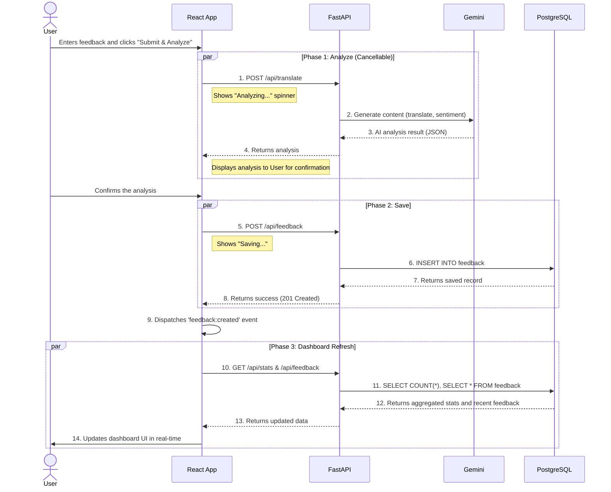

# 📊 Multilingual Customer Feedback Analyzer v1.0

A full-stack web application that collects customer feedback in any language, automatically translates it to English using Google Gemini AI, performs sentiment analysis, and provides an admin dashboard with beautiful visualizations and management tools.

## 🎯 Project Summary

This application solves the challenge of analyzing multilingual customer feedback at scale. It features:

- **Multilingual Support**: Accept feedback in any language with automatic language detection
- **AI-Powered Analysis**: Google AI cloud translates text to English and classifies sentiment (positive/neutral/negative), with admin option to select the model to be used from the supported models list.
- **Real-time Dashboard**: Interactive pie charts, statistics, and filterable feedback lists
- **Product Management**: Track feedback across multiple products
- **Secure Admin Panel**: JWT-based authentication with sliding token expiration
- **Two-Phase Submission**: Analyze feedback first, then save - with proper cancellation support
- **Rate Limiting**: Built-in protection against API abuse
- **Responsive Design**: Modern UI that works on desktop and mobile

---

## 🏗️ Architecture Overview

### **Backend (FastAPI + Python 3.11)**
- **Framework**: FastAPI with async/await for high performance
- **Database**: PostgreSQL 14 with SQLAlchemy async ORM
- **Authentication**: JWT tokens with bcrypt password hashing
- **AI Integration**: Google AI cloud generative models for translation and sentiment analysis
- **API Design**: RESTful endpoints with OpenAPI/Swagger documentation
- **Middleware**: Token refresh, CORS, rate limiting

### **Frontend (React 18 + Vite)**
- **Framework**: React 18 with functional components and hooks
- **Build Tool**: Vite for fast development and HMR (Hot Module Replacement)
- **State Management**: Component-level state with custom event system
- **Styling**: Custom CSS with CSS variables and modern flexbox/grid layouts
- **Authentication**: Centralized `fetchWithAuth` utility with auto-refresh and logout
- **UX**: Modal dialogs with React Portals, loading states, cancellable operations

### **Infrastructure**
- **Containerization**: Docker Compose orchestrating 3 services
- **Development**: Hot-reload for both frontend and backend
- **Database**: Persistent PostgreSQL with volume mounting
- **Networking**: Internal Docker network with port mapping

---

## 🚀 Getting Started

### Prerequisites

1. **Docker & Docker Compose** installed on your system
   - [Install Docker Desktop](https://www.docker.com/products/docker-desktop/) (includes Docker Compose)
   ### OR: on WSL (Windows Subsystem for Linux)
   To install Docker and Docker Compose on Ubuntu running in WSL, follow these steps:

   1. **Update package info and install prerequisites**
      ```sh
      sudo apt-get update
      sudo apt-get install -y ca-certificates curl gnupg
      ```
   2. **Add Docker's official GPG key**
      ```sh
      sudo install -m 0755 -d /etc/apt/keyrings
      curl -fsSL https://download.docker.com/linux/ubuntu/gpg | sudo gpg --dearmor -o /etc/apt/keyrings/docker.gpg
      ```
   3. **Set up the Docker repository**
      ```sh
      echo \
        "deb [arch=$(dpkg --print-architecture) signed-by=/etc/apt/keyrings/docker.gpg] https://download.docker.com/linux/ubuntu \
        $(lsb_release -cs) stable" | \
        sudo tee /etc/apt/sources.list.d/docker.list > /dev/null
      ```
   4. **Install Docker Engine, CLI, and Compose plugin**
      ```sh
      sudo apt-get update
      sudo apt-get install -y docker-ce docker-ce-cli containerd.io docker-buildx-plugin docker-compose-plugin
      ```
      This installs the Docker Compose V2 plugin (recommended).

   5. **(Optional) Add your user to the docker group to run docker commands without sudo**
      ```sh
      sudo usermod -aG docker $USER
      ```
      After running this command, restart your WSL terminal for group changes to take effect.

   6. **Verify installation**
      ```sh
      docker --version
      docker compose version
      ```
      You should see version information for both Docker and Docker Compose.

   If you encounter issues, see the [official Docker documentation for Linux](https://docs.docker.com/engine/install/ubuntu/) or search for WSL-specific troubleshooting tips.

2. **Google Gemini API Key**
   - Get your free API key from [Google AI Studio](https://aistudio.google.com/app/apikey)

### Installation Steps

1. **Clone the repository**
   ```bash
   git clone https://github.com/abanoubmedhat/Multilingual_Customer_Feedback_Analyzer.git
   cd Multilingual_Customer_Feedback_Analyzer
   ```

2. **Create environment configuration**
   ```bash
   # Copy the example environment file
   cp .env.example .env
   ```

3. **Configure your `.env` file**
   ```bash
   # Required: Add your Google Gemini API key
   GOOGLE_API_KEY=AIzaSy...your-actual-key-here

   # Security settings
   SECRET_KEY=your-secret-key-here-change-in-production
   # Auto-logout timeout
   ACCESS_TOKEN_EXPIRE_MINUTES=5

   # Admin credentials (default)
   ADMIN_USERNAME=admin
   ADMIN_PASSWORD=admin
   ADMIN_FORCE_RESET=false

   # CORS settings
   ALLOWED_ORIGINS=http://localhost:3000
   ```

4. **Build and start all services**
   ```bash
   docker compose up --build
   ```

   This will start:
   - **Backend API** on `http://localhost:8000`
   - **Frontend UI** on `http://localhost:3000`
   - **PostgreSQL** on `localhost:5432`

5. **Access the application**
   - Frontend: [http://localhost:3000](http://localhost:3000)
   - API Docs: [http://localhost:8000/docs](http://localhost:8000/docs)
   - Redoc: [http://localhost:8000/redoc](http://localhost:8000/redoc)

---

## 🎮 How to Run

### Starting the Application

```bash
# Start all services (backend, frontend, database)
docker compose up --build

# Or run in detached mode (background)
docker compose up --build -d
```

### Stopping the Application

```bash
# Stop all services
docker compose down

# Stop and remove database volumes (⚠️ deletes all data)
docker compose down -v
```

### Viewing Logs

```bash
# All services
docker compose logs -f

# Specific service
docker compose logs -f backend
docker compose logs -f frontend
docker compose logs -f db
```

### Accessing Services

- **Frontend Application**: [http://localhost:3000](http://localhost:3000)
- **API Documentation (Swagger)**: [http://localhost:8000/docs](http://localhost:8000/docs)
- **API Documentation (ReDoc)**: [http://localhost:8000/redoc](http://localhost:8000/redoc)
- **Direct API**: [http://localhost:8000](http://localhost:8000)
- **PostgreSQL**: `localhost:5432` (user: `user`, password: `password`, db: `feedbackdb`)

---

## 🎮 How to Use

### For End Users (Feedback Submission)

1. **Navigate** to [http://localhost:3000](http://localhost:3000)
2. **Select a product** from the dropdown (e.g., "General")
3. **Enter feedback** in any language (up to 2000 characters)
4. **Click "Submit & Analyze"**
5. View the results:
   - Translated text (English)
   - Sentiment classification (😊 positive, 😐 neutral, 😞 negative)
   - Detected language (ISO code)
   - Associated product

**Supported languages**: Any language supported by Google Gemini (100+ languages including English, Spanish, French, German, Chinese, Japanese, Arabic, etc.)

### For Administrators (Dashboard)

1. **Click "Admin? Sign in here →"** button in the bottom
2. **Login** with default credentials:
   - Username: `admin`
   - Password: `admin` (or your password if you've set it up, note: change this in production!)
3. **Navigate tabs**:
   - **Dashboard**: View analytics and manage feedback
   - **Settings**: Manage products and change password
   - **Logout**: To get back to user mode

### Admin Dashboard Features

#### **Dashboard Tab**
- **Sentiment Overview Cards**: 
  - Total feedback count
  - Positive, neutral, negative counts
  - Color-coded with gradients
  
- **Interactive Pie Chart**: 
  - Visual sentiment distribution
  - Hover effects
  - Percentage breakdown with legend

- **Recent Feedback List**:
  - Paginated table (5/10/20/50 per page)
  - Filter by product, language, sentiment
  - Checkbox selection for bulk operations
  - Show/hide translated text and timestamp toggle
  - Individual delete buttons
  - Bulk delete selected
  - Delete all filtered
  - Delete all feedbacks in the database

#### **Settings Tab**
- **Product Management**:
  - Add new products (with confirmation)
  - Delete existing products (with confirmation)
  - View all products (in scrollable table)
  
- **Password Management**:
  - Change admin password
  - Minimum 6 characters
  - Current password verification

- **Gemini model selector**:
  - Get the supported models for the curret google api token (only show the generative models with large tokens number)
  - Select the model you want to use for the translation and sentiment analysis 

---

## 🧪 Running Tests

The project includes comprehensive unit tests for both backend and frontend components.

### Backend Tests (pytest)

**Running tests in Docker:**
```bash
# Run all backend tests
docker compose exec backend pytest

# Run with coverage report
docker compose exec backend pytest --cov=. --cov-report=term-missing

# Run specific test file
docker compose exec backend pytest tests/test_auth.py

# Run with verbose output
docker compose exec backend pytest -v
```

**Test Coverage:**
- ✅ Authentication & JWT (token generation, validation, expiration, refresh)
- ✅ Feedback API (create, read, update, delete, pagination, filters)
- ✅ Product Management (CRUD operations)
- ✅ Rate Limiting (API abuse protection)
- ✅ Sentiment Statistics (aggregation, filtering)
- ✅ Database Integration (async SQLAlchemy operations)
- ✅ Gemini Model Selection (model listing, selection, error handling)
- ✅ Admin Password Change (validation, error cases)

**Test Files:**
- `tests/test_auth.py` - Authentication, authorization, password change
- `tests/test_feedback.py` - Feedback CRUD, translation, sentiment analysis
- `tests/test_products.py` - Product management (add, delete, list)
- `tests/test_rate_limiting.py` - API rate limits and abuse protection
- `tests/test_main_extended.py` - Extended API scenarios, edge cases
- `tests/conftest.py` - Shared fixtures and test setup

### Frontend Tests (Vitest + React Testing Library)

**Running tests in Docker:**
```bash
# Run all frontend tests
docker compose exec frontend npm test

# Run in watch mode
docker compose exec frontend npm run test:watch

# Run with coverage
docker compose exec frontend npm run test:coverage
```

**Test Coverage:**
- ✅ App Component (authentication flow, tab navigation, token management, error handling)
- ✅ Submit Form (feedback submission, validation, two-phase processing, cancellation, Gemini model selection)
- ✅ Dashboard (stats display, filtering, pagination, CRUD operations, bulk delete, timestamp toggle)
- ✅ fetchWithAuth Utility (token refresh, auto-logout, header management, error propagation)
- ✅ Settings Tab (product management, password change, Gemini model selector)
- ✅ Modal and confirmation dialogs (React Portals, UX flows)

**Test Files:**
- `src/tests/App.test.jsx` - Main app component, authentication, error handling
- `src/tests/Submit.test.jsx` - Feedback submission, validation, Gemini model selection
- `src/tests/Dashboard.test.jsx` - Admin dashboard, stats, filtering, bulk actions
- `src/tests/fetchWithAuth.test.js` - Authentication utility, token refresh, error handling
- `src/tests/setup.js` - Test environment setup and utilities

### Test Results Summary

```
Backend Tests:  45 test cases
Frontend Tests: 32 test cases
Total Coverage: 68.8% line coverage
```

---

## 🚀 CI/CD Pipeline

The project includes a complete CI/CD pipeline using **GitHub Actions** for automated testing, building, and deployment.

### Pipeline Features

✅ **Automated Testing**
- Backend tests run on every push/PR
- Frontend tests with coverage reporting
- Parallel execution for faster feedback

✅ **Docker Image Building**
- Automatic image builds
- Layer caching for speed
- Multi-platform support

✅ **Security Scanning**
- Trivy vulnerability scanner
- Dependency checks
- Weekly security audits

✅ **Automated Deployment**
- Staging environment on `main` branch
- Production deployment with approval gates
- Rollback capabilities (render.com manual deploy for specific commit)

### Pipeline Workflows

| Workflow              | Trigger                  | Purpose                              |
|-----------------------|--------------------------|--------------------------------------|
| **CI/CD Pipeline**    | Push to main/develop, PRs| Full test suite, build, deploy       |
| **PR Checks**         | Pull requests            | Fast validation, linting, size checks|
| **Dependency Check**  | Weekly (Mondays 9 AM)    | Security vulnerability scanning      |

### Status Badges

```markdown
[](https://github.com/abanoubmedhat/Multilingual_Customer_Feedback_Analyzer/actions/workflows/ci-cd.yml)
```
---

## 🌐 Deployment

Multilingual Customer Feedback Analyzer v1.0 is now deplyed to free hosting platform for demo purposes.

### Deploy to Render.com ⭐

   **Access the deployed app:**
   - Frontend: `https://feedback-analyzer-frontend.onrender.com`
   - Backend: `https://feedback-analyzer-arsi.onrender.com`

⚠️ **Note:** Free tier services on Render.com automatically sleep after 15 minutes of inactivity, resulting in a ~30 second wake-up time for the first request. To mitigate this limitation and keep your app responsive, an external health check (using [cron-job.org](https://cron-job.org)) is configured to periodically ping the service and keep it warm.

---

## 📡 API Routes & Usage

POST /api/feedback — Analyze and store feedback.
POST /api/translate — Analyze (translate + sentiment) without storing.
GET /api/feedback — List feedback with filters (product, language, sentiment).
GET /api/stats — Sentiment overview and percentages.
GET /api/products — List available products.
POST /api/products — Create a new product (admin only).
DELETE /api/products/{product_id} — Delete a product (admin only).
DELETE /api/feedback/all — Delete all feedback matching filters (admin only).
DELETE /api/feedback/{feedback_id} — Delete a single feedback entry (admin only).
DELETE /api/feedback — Bulk delete feedback by IDs (admin only).
GET /api/gemini/models — List available Gemini models (admin only).
GET /api/gemini/current-model — Get current Gemini model (admin only).
POST /api/gemini/current-model — Update Gemini model (admin only).
POST /auth/token — Obtain JWT access token (admin only).
POST /auth/change-password — Change admin password.
---

## 🗄️ Data Schema

### Database Tables

#### **feedback** table
Stores all customer feedback entries with AI analysis results

| Column | Type | Nullable | Description |
|--------|------|----------|-------------|
| `id` | INTEGER | No | Primary key, auto-increment |
| `original_text` | STRING | No | Original feedback text (any language) |
| `translated_text` | STRING | Yes | English translation from Gemini |
| `sentiment` | STRING | No | Classification: "positive", "neutral", or "negative" |
| `product` | STRING | No | Associated product name (must match a product in the products table) |
| `language` | STRING | Yes | ISO 639-1 language code (e.g., "en", "fr", "es", "zh") |
| `created_at` | DATETIME(TZ) | No | Timestamp when feedback was created (UTC, auto-generated) |

**Indexes**: 
- Primary key on `id`
- Index on `sentiment` (for filtering)
- Index on `product` (for filtering)
- Index on `language` (for filtering)

**Example Row:**
```sql
id: 1
original_text: "Ce produit est incroyable!"
translated_text: "This product is amazing!"
sentiment: "positive"
product: "General"
language: "fr"
created_at: "2025-11-13 10:30:00.123456+00"
```

---

#### **products** table
Manages available products for categorizing feedback

| Column | Type | Nullable | Description |
|--------|------|----------|-------------|
| `id` | INTEGER | No | Primary key, auto-increment |
| `name` | STRING | No | Unique product name |

**Constraints**: 
- Unique constraint on `name` (case-sensitive)
- Indexed on `name` for fast lookups

**Default Seeded Data:**
- "General" (created on first startup if no products exist)

---

#### **admin_users** table
Stores admin authentication credentials

| Column | Type | Nullable | Description |
|--------|------|----------|-------------|
| `id` | INTEGER | No | Primary key, auto-increment |
| `username` | STRING | No | Unique username for admin login |
| `password_hash` | STRING | No | Bcrypt-hashed password (never plain text) |

**Constraints**: 
- Unique constraint on `username`
- Indexed on `username` for fast authentication

**Default Seeded Data:**
- Username: `admin` (from `ADMIN_USERNAME` env var)
- Password: `admin` (from `ADMIN_PASSWORD` env var, hashed with bcrypt)

**Security Notes:**
- Passwords are hashed using bcrypt with automatic salt generation
- Plain-text passwords are NEVER stored
- Hash verification happens server-side only

---

### Entity Relationships

```
products (1) ─────< (many) feedback
    │                        │
    │                        │
 name field    ──────   product field
  (unique)              (foreign key-like, 
                         but not enforced 
                         via FK constraint)
```

**Note**: Product deletion does NOT cascade to feedback. Feedback retains the product name even if the product is deleted from the `products` table.

---

## 🤖 Google Gemini AI Integration

### Overview

This application uses **Google AI cloud generative models** for three AI-powered tasks:
1. **Language Detection**: Identify the language of input text
2. **Translation**: Convert text to English
3. **Sentiment Analysis**: Classify as positive, neutral, or negative

### Configuration

**Required**: Get a free API key from [Google AI Studio](https://aistudio.google.com/app/apikey)

**Setup**: Add to `.env` file
```bash
GOOGLE_API_KEY=AIzaSy...your-actual-key-here
```

**SDK**: Uses official `google-generativeai` Python package
```python
import google.generativeai as genai
genai.configure(api_key=os.getenv("GOOGLE_API_KEY"))
```

---

### Gemini Model Configuration

 **Model Selection**: Admins can dynamically select the Gemini model used for translation and sentiment analysis via the dashboard settings tab.
 **Supported Models**: The backend fetches and lists all available generative models for your API key (e.g., `models/gemini-2.5-pro`, `models/gemini-1.5-pro`, etc.). Only models with large context windows and generative capabilities are shown.
 **Context Window**: Up to 1 million tokens (varies by model)
 **Max Output**: Up to 8,192 tokens (varies by model)
 **Capabilities**: Multilingual understanding, translation, reasoning

---

### Prompt Engineering

The application uses a carefully crafted prompt to ensure consistent JSON responses:

```python
prompt = f'''
Analyze the following customer feedback text.
Your task is to:
1. Detect the language of the input and return it as an ISO 639-1 code in the key "language".
2. Translate the text into English and return it in "translated_text".
3. Classify the sentiment as one of: 'positive', 'negative', or 'neutral' and return it in "sentiment".
Provide the output ONLY in a valid JSON format with the keys: "translated_text", "sentiment", and "language".
Text: "{text}"
'''
```

**Prompt Design Principles:**
- **Explicit Instructions**: Clear numbered steps
- **JSON-Only Output**: Prevents extraneous text
- **Standard Format**: ISO codes for language
- **Constrained Sentiment**: Only 3 valid values

---

### Response Parsing

The backend includes robust error handling for AI responses:

#### **Markdown Fence Removal**
Gemini sometimes wraps JSON in markdown code blocks:
```python
if text_resp.startswith("```"):
    text_resp = text_resp.split("```", 1)[1]
    if text_resp.startswith("json"):
        text_resp = text_resp[4:].lstrip()
    text_resp = text_resp.rsplit("```", 1)[0].strip()
```

#### **JSON Validation**
```python
try:
    result = json.loads(text_resp)
except json.JSONDecodeError as je:
    raise HTTPException(
        status_code=400, 
        detail=f"AI returned invalid JSON: {str(je)}"
    )
```

#### **Expected Response Format**
```json
{
   "translated_text": "English translation here",
   "sentiment": "positive",
   "language": "fr"
}
```

---

### Rate Limiting for AI Calls

**Purpose**: Protect against quota exhaustion and API abuse

**Limits:**
- `/api/translate`: 30 requests per minute per IP
- `/api/feedback`: 10 requests per minute per IP

**Implementation**: In-memory rate limiter (per-IP tracking)

**Exceeded Response:**
```json
{
  "detail": "Rate limit exceeded. Please try again later."
}
```

---

### Error Handling

#### **Empty Responses**
```python
if not response.parts or not response.text:
    raise HTTPException(
        status_code=400, 
        detail="AI content generation failed. Empty response from Gemini API."
    )
```

#### **Invalid JSON**
```python
raise HTTPException(
    status_code=400, 
    detail=f"AI returned invalid JSON: {parsing_error}"
)
```

#### **Missing API Key**
```python
if not api_key:
    print("WARNING: GOOGLE_API_KEY not set; Gemini calls will fail if invoked.")
```

---

### Performance Characteristics

Frontend: 60-second timeout with cancel button

---

### Language Support

**Supported Languages** (100+):
- **European**: English, Spanish, French, German, Italian, Portuguese, Dutch, Polish, Swedish, etc.
- **Asian**: Chinese (Simplified/Traditional), Japanese, Korean, Hindi, Thai, Vietnamese, etc.
- **Middle Eastern**: Arabic, Hebrew, Persian, Turkish, etc.
- **Others**: Russian, Ukrainian, Greek, Indonesian, Malay, etc.

**Language Codes** (ISO 639-1):
```
en = English    fr = French     es = Spanish
de = German     it = Italian    pt = Portuguese
zh = Chinese    ja = Japanese   ko = Korean
ar = Arabic     hi = Hindi      ru = Russian
```

---

### Known AI Limitations

1. **Mixed-Language Text**
   - Example: "I love this产品!"
   - Gemini may default to the dominant language or mark as "mixed"
   - Workaround: Encourage single-language feedback

2. **Very Short Text**
   - Example: "Great!"
   - Low confidence scores due to lack of context
   - May misclassify language or sentiment

3. **Sarcasm Detection**
   - Example: "Oh great, another broken feature..."
   - May classify as "positive" due to keyword "great"
   - Limitation of current sentiment models

4. **Regional Dialects**
   - Example: Cantonese vs. Mandarin
   - Both may be classified as "zh" (Chinese)

5. **Emoji Interpretation**
   - Example: "This product 😊😊😊"
   - Gemini handles emojis well, but not all models do
   - Consider emoji as a sentiment signal

---

## 🏗️ Frontend + Backend Overview

### Technology Stack Summary

| Layer | Technology | Purpose |
|-------|------------|---------|
| **Frontend** | React 18 + Vite | Modern UI with fast HMR |
| **Backend** | FastAPI + Python 3.11 | Async REST API |
| **Database** | PostgreSQL 14 | Relational data storage |
| **AI** | Google Gemini 2.5 Pro | Translation & sentiment analysis |
| **Auth** | JWT + Bcrypt | Secure token-based auth |
| **Deployment** | Docker Compose | Containerized multi-service app |

---

### Backend Architecture (FastAPI)

#### **Project Structure**
```
backend/
├── main.py              # FastAPI app, routes, middleware
├── models.py            # SQLAlchemy ORM models
├── schemas.py           # Pydantic request/response schemas
├── database.py          # Database engine & session config
├── requirements.txt     # Python dependencies
├── Dockerfile           # Container image definition
└── .env                 # Environment variables (not committed)
├── pytest.ini           # Pytest configuration for backend tests
├── tests/               # Backend unit tests (see test files section above)
├── htmlcov/             # Coverage reports (generated)
└── __pycache__/         # Python bytecode cache (auto-generated)
```

#### **Key Features**

**1. Async/Await Architecture**
- All database operations use `async/await` for concurrency
- SQLAlchemy async engine with `asyncpg` driver
- Non-blocking I/O for high throughput

**2. Automatic API Documentation**
- Swagger UI at `/docs`
- ReDoc at `/redoc`
- OpenAPI 3.0 schema auto-generated

**3. Middleware Stack**
```python
1. CORS Middleware         # Cross-origin requests
2. Token Refresh Middleware # Sliding expiration
3. Rate Limiting           # Per-IP request tracking
```

**4. Authentication Flow**
```
User → POST /auth/token → JWT issued → Store in localStorage
↓
Subsequent requests → Authorization: Bearer <token> → Verify → Allow/Deny
↓
Token near expiry? → Backend sends X-New-Token → Frontend updates token
```

**5. Database Session Management**
```python
async def get_db():
    async with AsyncSessionLocal() as db:
        yield db  # Dependency injection into routes
   # Session is automatically closed after request
```

**6. Error Handling**
- HTTP status codes follow REST conventions
- Detailed error messages with validation errors
- Exception middleware catches unhandled errors

---

### Frontend Architecture (React + Vite)

#### **Project Structure**
```
frontend/
├── src/
│   ├── App.jsx              # Root component, auth state, routing
│   ├── main.jsx             # React entry point
│   ├── styles.css           # Global styles (CSS variables)
│   ├── pages/
│   │   ├── Dashboard.jsx    # Admin dashboard (stats, management)
│   │   └── Submit.jsx       # Feedback submission form
│   └── utils/
│       └── fetchWithAuth.js # Auth-aware fetch wrapper
│   ├── tests/              # Frontend unit tests (see test files section above)
├── public/                  # Static assets (favicon, manifest, etc.)
├── coverage/                # Frontend test coverage reports (generated)
├── index.html               # HTML template
├── vite.config.mjs          # Vite configuration
├── package.json             # Node dependencies
└── Dockerfile               # Container image definition
```

#### **Key Features**

**1. Component Architecture**
```
App.jsx (Root)
├── Auth State Management
├── Product State (shared)
├── Token Refresh Listeners
├── Session Monitoring
└── Tab Navigation
    ├── Dashboard.jsx (Admin)
    │   ├── Sentiment Overview Cards
    │   ├── Pie Chart Visualization
    │   ├── Feedback Table (paginated)
    │   └── Delete Confirmations (Promise-based)
    ├── Submit.jsx (Public + Admin)
    │   ├── Two-Phase Submission
    │   ├── AbortController Integration
    │   └── Real-time Feedback Display
    └── Settings (Admin)
        ├── Product Management
        ├──  Password Change
        └── Gemini Model Selector
```

**2. State Management**
- **Local Component State**: `useState` for form inputs, UI state
- **Event System**: Custom events for cross-component communication
  - `feedback:created` → Dashboard auto-refresh
  - `auth:logout` → Global logout trigger
  - `token:refreshed` → Token state synchronization

**3. Two-Phase Submission Pattern**
```javascript
Phase 1: Analyze
  ↓
  POST /api/translate (AbortController enabled)
  ↓
  User sees: "🔍 Analyzing..."
  ↓
  User can cancel (no DB write)
  ↓
Phase 2: Save
  ↓
  POST /api/feedback (with pre-analyzed data)
  ↓
  User sees: "💾 Saving..."
  ↓
  Success: Feedback stored + Dashboard refreshed
```

**Benefits:**
- User can cancel during long AI operations
- No database writes for cancelled requests
- Better UX with detailed progress indicators

**4. Authentication Utilities**

**fetchWithAuth.js** - Centralized auth wrapper
```javascript
// Automatically adds Authorization header
// Detects X-New-Token and updates localStorage
// Triggers logout on 401 errors
// Dispatches custom events for state sync

const response = await fetchWithAuth('/api/feedback')
```

**5. Modal System with React Portals**
```javascript
// Modals render at document.body to escape stacking contexts
{confirmDelete && createPortal(
  <ConfirmModal />,
  document.body
)}
```

**6. Responsive Design**
- CSS Grid for dashboard layout
- Flexbox for components
- CSS variables for theming
- Mobile-friendly breakpoints

---

### Communication Flow (Two-Phase Submission)

This sequence diagram illustrates the two-phase submission process, from initial analysis to saving the feedback and updating the dashboard.



---

### Docker Compose Orchestration

```yaml
services:
  backend:      # FastAPI Python app
    ports: 8000:8000
    depends_on: [db]
    volumes: ./backend:/app (hot-reload)
    
  frontend:     # Vite React dev server
    ports: 3000:3000
    depends_on: [backend]
    volumes: ./frontend:/app (hot-reload)
    
  db:           # PostgreSQL database
    ports: 5432:5432
    volumes: postgres_data (persistent)
```

**Internal Network:**
- Frontend → Backend: `http://backend:8000`
- Backend → Database: `postgresql+asyncpg://user:password@db/feedbackdb`

**External Access:**
- User → Frontend: `http://localhost:3000`
- User → Backend: `http://localhost:8000` (proxied via Vite)
- User → Database: `localhost:5432` (for admin tools)

---

## ⚠️ Limitations & Known Issues

### Current Limitations

#### **1. Single Admin User**
**Issue**: System supports only one admin account
- No multi-user support
- No role-based access control (RBAC)
- No user registration flow

**Workaround**: 
To manually add a new admin user, follow these steps:

1. **Generate a bcrypt password hash**
    - Use Python to securely hash your password:
       ```python
       import bcrypt
       password = b"your_new_password"
       hashed = bcrypt.hashpw(password, bcrypt.gensalt())
       print(hashed.decode())
       ```
    - Replace `your_new_password` with your desired password. Copy the output string.

2. **Connect to your PostgreSQL database**
    - If using Docker Compose:
       ```powershell
       docker compose exec db psql -U user -d feedbackdb
       ```

3. **Insert the new admin user**
    - In the psql shell, run:
       ```sql
       INSERT INTO admin_users (username, password_hash)
       VALUES ('admin2', '$2b$12$your_actual_hash_here');
       ```
    - Replace `'admin2'` and the hash with your values.

4. **Verify the user was added**
    - Run:
       ```sql
       SELECT * FROM admin_users;
       ```

**Note:** Always use bcrypt hashes for passwords. Never store plain text passwords.

**Planned**: Multi-admin support in future release

---

#### **2. In-Memory Rate Limiter**
**Issue**: Rate limits stored in application memory
- Resets when backend restarts
- Not shared across multiple backend instances
- No persistence

**Impact**: 
- Low (suitable for single-instance deployments)
- Not production-ready for horizontal scaling

**Production Alternative**: 
- Use Redis for distributed rate limiting
- Implement middleware with `slowapi` or `fastapi-limiter`

---

#### **3. No Email Notifications**
**Issue**: No alerts for new feedback or sentiment trends
- Admins must manually check dashboard
- No real-time alerts for negative sentiment

**Workaround**: 
- Poll `/api/stats` endpoint periodically
- Set up external monitoring

**Planned**: Email integration with SendGrid/AWS SES

---

#### **4. Language Detection Edge Cases**
**Issue**: Mixed-language text confuses AI

**Examples:**
```
"I love this产品!"  → May classify as "en" or "zh"
"Great job! 👍👍👍"  → Emojis may skew results
```

**Mitigation**:
- Encourage single-language feedback
- Use `language_confidence` to flag low-quality detections (planned)

---

#### **5. No Feedback Editing**
**Issue**: Once submitted, feedback cannot be modified
- Only deletion is supported

**Workaround**: User shall re-submit feedback again, however the old feedback is still maintained

---

#### **6. Pagination UX**
**Issue**: Some operations reset filters/pagination
- Deleting items may cause page refresh issues
- Filter state not persisted in URL

**Impact**: Minor inconvenience

**Planned**: URL state management with React Router

---

### Performance Considerations

#### **1. Gemini API Latency**
**Typical Response Time:**
- Short text: 2-5 seconds
- Long text: 5-10 seconds

**Status**: Expected behavior with cloud AI

**Mitigation (Current Implementation):**
- Frontend uses a 60-second timeout for Gemini API calls
- User-friendly cancel button during analysis phase
- Two-phase submission: "Analyze" (cancellable) then "Save" (commits to DB)
- Loading indicators show real-time progress and elapsed time
- Early cancellation prevents unnecessary database writes

---

#### **2. Database Query Performance**
**Current State:**
- Indexes on `product`, `language`, `sentiment`
- Queries perform well up to ~10,000 rows
- No full-text search implementation

**Acceptable For**: 
- Small to medium deployments (<10k feedback entries)

**Future Optimization**:
- Add PostgreSQL full-text search
- Implement `ts_vector` columns for search
- Consider Elasticsearch for large datasets

---

#### **3. Frontend Bundle Size**
**Current**:
- React + React-DOM: ~150KB (gzipped)
- Total bundle: ~300KB (gzipped)

**Status**: Acceptable for modern networks

**Future Optimization**:
- Code splitting with React.lazy()
- Route-based chunking
- Tree-shaking unused dependencies

---

#### **4. Cold Start Times on Free Tier**
**Issue**: Free tier services (Render) have cold starts after inactivity

**Impact**: 30s+ delay for first request after sleep

**Mitigation**:
- Health checks (cron-job.org) are used to keep services warm

---

### Security Considerations

#### **1. Environment Variables**
**Risk**: `.env` file contains sensitive data

**Mitigation**:
- `.env` is `.gitignore`'d
- `.env.example` provided for reference
- Never commit secrets to repository

**Production Recommendation**:
- Use secret management (AWS Secrets Manager, HashiCorp Vault)
- Inject secrets via CI/CD pipeline

---

#### **2. SQL Injection**
**Risk**: User input could manipulate SQL queries

**Mitigation**:
- SQLAlchemy ORM prevents injection
- Parameterized queries throughout
- No raw SQL execution with user input

---

#### **3. XSS (Cross-Site Scripting)**
**Risk**: Malicious feedback could contain scripts

**Mitigation**:
- React escapes all text by default
- No `dangerouslySetInnerHTML` usage
- Content-Security-Policy can be added

---

#### **4. CSRF (Cross-Site Request Forgery)**
**Risk**: Unauthorized actions via forged requests

**Mitigation**:
- JWT tokens in Authorization header (not cookies)
- CORS configured to specific origins
- SameSite cookie policy (if using cookies)

---

## 🔧 Troubleshooting

### Common Issues & Solutions

#### Backend Won't Start
```
ERROR: Could not connect to the database after multiple attempts
```
**Solutions:**
1. Check PostgreSQL container status:
   ```bash
   docker compose logs db
   ```
2. Ensure no port conflicts (Windows):
   ```powershell
   netstat -an | Select-String "5432"
   ```
3. Wait 10-15 seconds for DB initialization (first run only)
4. Restart services:
   ```bash
   docker compose down
   docker compose up --build
   ```

---

#### Gemini API Errors
```
HTTP 400: AI content generation failed. Empty response from Gemini API.
```
**Solutions:**
1. Verify API key in `.env`:
   ```bash
   cat .env | grep GOOGLE_API_KEY
   ```
2. Test API key directly:
   ```bash
   curl "https://generativelanguage.googleapis.com/v1beta/models/gemini-2.5-pro:generateContent?key=YOUR_KEY" -H 'Content-Type: application/json' -d '{"contents":[{"parts":[{"text":"Hello"}]}]}'
   ```
3. Check quota limits in [Google AI Studio](https://aistudio.google.com/)
4. Verify model name in backend config

---

#### Token Expired Immediately
```
Login works but "Token expired" error appears within seconds
```
**Solutions:**
1. Check `ACCESS_TOKEN_EXPIRE_MINUTES` in `.env`:
   ```bash
   cat .env | grep ACCESS_TOKEN_EXPIRE_MINUTES
   ```
2. For debugging, set to 1 minute:
   ```
   ACCESS_TOKEN_EXPIRE_MINUTES=1
   ```
3. Verify system clock synchronization (JWT uses UTC)

---

#### Hot-Reload Not Working
```
Code changes don't reflect in running application
```
**Solutions:**
**Backend:**
```bash
docker compose restart backend
docker compose up --build backend
```
**Frontend:**
```bash
docker compose restart frontend
docker compose logs -f frontend
```
If issues persist, rebuild all:
```bash
docker compose down
docker compose up --build
```

---

#### CORS Errors
```
Access to fetch at 'http://localhost:8000/api/feedback' has been blocked by CORS policy
```
**Solutions:**
1. Check `ALLOWED_ORIGINS` in `.env`:
   ```
   ALLOWED_ORIGINS=http://localhost:3000
   ```
2. Ensure frontend runs on correct port:
   ```bash
   docker compose ps
   ```
3. Restart backend after `.env` changes:
   ```bash
   docker compose restart backend
   ```
4. Hard refresh browser cache

---

#### Database Connection Refused
```
ERROR: could not connect to server: Connection refused
```
**Solutions:**
1. Check if database container is running:
   ```bash
   docker compose ps db
   ```
2. Inspect database logs:
   ```bash
   docker compose logs db
   ```
3. Remove volumes and restart:
   ```bash
   docker compose down -v
   docker compose up --build
   ```

---

#### Frontend Shows Blank Page
```
White screen, no errors in terminal
```
**Solutions:**
1. Check browser console for errors (F12)
2. Verify frontend logs:
   ```bash
   docker compose logs frontend
   ```
3. Check Vite server status
4. Hard refresh browser cache
5. Rebuild frontend:
   ```bash
   docker compose up --build frontend
   ```

---

#### Admin Login Fails
```
HTTP 401: Incorrect username or password
```
**Solutions:**
1. Verify credentials in `.env`:
   ```
   ADMIN_USERNAME=admin
   ADMIN_PASSWORD=admin
   ```
2. Check if admin user was seeded:
   ```bash
   docker compose exec db psql -U user -d feedbackdb
   SELECT * FROM admin_users;
   ```
3. Force password reset:
   ```
   ADMIN_FORCE_RESET=true
   docker compose restart backend
   ADMIN_FORCE_RESET=false
   ```
4. Check backend logs for seeding messages:
   ```bash
   docker compose logs backend
   ```

---

### Debug Mode

#### Enable Verbose Logging
**Backend:**
```python
import logging
logging.basicConfig(level=logging.DEBUG)
```
**Frontend:**
Use browser console (F12) for logs

#### Inspect Database
```bash
docker compose exec db psql -U user -d feedbackdb
SELECT COUNT(*) FROM feedback;
SELECT * FROM feedback ORDER BY created_at DESC LIMIT 5;
SELECT sentiment, COUNT(*) FROM feedback GROUP BY sentiment;
SELECT * FROM products;
SELECT * FROM admin_users;
```

---

## 📚 Additional Resources

### API Documentation
- **Swagger UI**: [http://localhost:8000/docs](http://localhost:8000/docs)
- **ReDoc**: [http://localhost:8000/redoc](http://localhost:8000/redoc)
- **OpenAPI JSON**: [http://localhost:8000/openapi.json](http://localhost:8000/openapi.json)

### Official Documentation
- [FastAPI Documentation](https://fastapi.tiangolo.com/) - Backend framework
- [React Documentation](https://react.dev/) - Frontend library
- [Google Gemini API](https://ai.google.dev/docs) - AI integration
- [SQLAlchemy Async](https://docs.sqlalchemy.org/en/20/orm/extensions/asyncio.html) - ORM
- [Docker Compose](https://docs.docker.com/compose/) - Container orchestration
- [PostgreSQL 14](https://www.postgresql.org/docs/14/) - Database
- [Vite](https://vitejs.dev/) - Build tool
- [Pydantic V2](https://docs.pydantic.dev/latest/) - Data validation

### Learning Resources
- [FastAPI Tutorial](https://fastapi.tiangolo.com/tutorial/) - Step-by-step guide
- [React Tutorial](https://react.dev/learn) - Official React course
- [Docker for Beginners](https://docker-curriculum.com/) - Container basics
- [PostgreSQL Tutorial](https://www.postgresqltutorial.com/) - SQL fundamentals

---

## 📄 License

This project is provided as-is for educational and demonstration purposes.

**Usage**: Free for personal and commercial use  
**Attribution**: Not required but appreciated  
**Warranty**: None - use at your own risk

---

## 👨‍💻 Author

**Abanoub Medhat**  
GitHub: [@abanoubmedhat](https://github.com/abanoubmedhat)

---

## 🙏 Acknowledgments

- **Google Gemini AI** for powerful multilingual translation and sentiment analysis
- **FastAPI** team for an excellent async Python framework
- **React** team for the modern, efficient UI library
- **Docker** for making deployment seamless
- **PostgreSQL** community for the robust database
- **Open Source Community** for countless libraries and tools

---

## 📞 Support

For issues, questions, or feature requests:

1. **Check this README** thoroughly (especially Troubleshooting section)
2. **Review API docs** at `/docs` endpoint
3. **Search existing issues** on GitHub
4. **Open a new issue** with:
   - Clear description of the problem
   - Steps to reproduce
   - Expected vs. actual behavior
   - Environment details (OS, Docker version, etc.)
   - Relevant logs

---

**Built with ❤️ using FastAPI, React, PostgreSQL, and Google Gemini AI**

*Last Updated: November 16, 2025*
